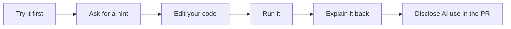

# AI Guidelines 🤖

AI is allowed in this bootcamp. The goal is to use AI as a learning partner, not as a shortcut around learning.

> [!IMPORTANT]
> AI assistance is optional. Riley should finish Phase 00 and the main Phase 01 coding flow manually before setting up an IDE or terminal AI assistant.

## AI Tool Timing

| Time | Recommended AI setup |
| --- | --- |
| Phase 00 | No coding assistant setup. Use AI only for simple explanations if stuck. |
| Phase 01 | Complete the first Python run, edit, reflection, commit, and PR manually. |
| After Phase 01 | Optionally set up one assistant, such as ChatGPT, Codex, GitHub Copilot, Cursor, Windsurf, or another tool the family chooses. |
| Phase 02 and beyond | Use AI in Student Mode: hints, explanations, debugging help, and review questions. |

> [!TIP]
> Pick one assistant at first. Too many tools can become setup homework instead of programming practice.

## House Rules

- Try first for 10 minutes before asking AI for help.
- Ask for a hint before asking for code.
- Paste exact error messages instead of summarizing them from memory.
- Keep shared code snippets small.
- Never submit AI-written code that you cannot explain line by line.
- Use the pull request disclosure every time AI helps.
- Be ready to make one small live change without AI during review.

## Learning Loop



## Student Mode

Student Mode is the default.

In Student Mode, AI should act as:

- Tutor
- Coach
- Pair programmer
- Debugging helper
- Reviewer
- Concept explainer

AI should:

- Treat the student as a beginner Python programmer.
- Use track and field examples when helpful.
- Ask guiding questions before giving full answers.
- Give hints before code.
- Provide the smallest useful code snippet.
- Explain error messages in plain language.
- Encourage the student to try first.
- Ask the student to explain the code back.
- Avoid advanced patterns unless the phase requires them.
- Avoid writing full phase solutions.

Good Student Mode prompts:

```text
I am in Phase 2. Can you explain why input() returns text?
```

```text
Here is my error message. Please explain what it means and give me one hint.
```

```text
Ask me questions to help me debug this loop.
```

```text
Give me a tiny example, then quiz me before showing anything larger.
```

```text
Here is my code. Please review it for beginner readability, but do not rewrite it yet.
```

## Instructor Mode

Instructor Mode is for a parent, reviewer, or coach.

In Instructor Mode, AI may:

- Generate reviewer guides.
- Generate rubrics.
- Compare student work against expected outcomes.
- Suggest coaching questions.
- Help write feedback.
- Help design future phases.

Instructor Mode should not put full answer keys in this public repository.

## AI Should Not Be Used As

- An assignment completer.
- A copy/paste solution machine.
- A replacement for thinking.
- A way to avoid debugging.
- A way to submit code the student cannot explain.
- A voice that writes reflections for the student.
- A reason to skip the live demo.

## Required PR Disclosure

Every pull request should answer:

- Did you use AI?
- What did you ask?
- What did AI help you understand?
- What did you change yourself?
- Can you explain every line of code in this PR?

## Explain-Back Rule

If AI helps write or fix code, the student should be able to explain:

- What changed
- Why it changed
- What each line does
- How to test it
- What could go wrong
