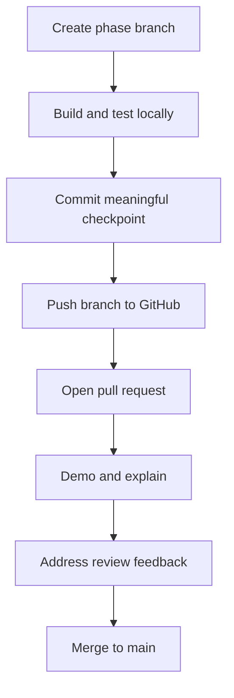

# Programming Intro Python Bootcamp

A beginner-friendly software engineering bootcamp for an incoming college freshman preparing for an introductory Python course.

This is a curriculum repository. The project app built through the phases is **Track Career Analyzer**, a Python project that grows from a terminal program into a simple data analysis and Streamlit app.

> [!NOTE]
> Start with [Phase 00](phases/phase-00-developer-workstation.md). Each phase is written like a guided working session: read a little, build a little, run it, explain it, then open a pull request.

> [!TIP]
> The goal is not to race through the files. The goal is to build enough confidence that Riley can explain what she made without needing AI to speak for her.

## Goals

- Learn how local development works on a MacBook.
- Learn Python fundamentals through a real project.
- Practice using Terminal, VS Code, Git, GitHub, Markdown, CSV files, pandas, and Streamlit.
- Build work in small phases, using branches and pull requests.
- Use AI as a tutor and reviewer without letting it replace student understanding.
- Finish with a demo-ready app and a clear explanation of how it works.

## Who This Is For

The first student is Riley Chapman, an incoming college freshman and track and field athlete considering Computer Science. The curriculum should remain reusable for future beginner programming students.

The course assumes:

- No prior programming experience required
- macOS
- VS Code
- Terminal
- GitHub account
- Willingness to explain code out loud

## Bootcamp Roadmap

The bootcamp is designed for 10 phases, roughly 3-5 hours per week and 25-40 total hours.

```mermaid
flowchart LR
    setup["00 Setup"] --> first["01 First Python"]
    first --> profile["02 Athlete Profile"]
    profile --> goals["03 Goals"]
    goals --> results["04 Multiple Results"]
    results --> funcs["05 Functions"]
    funcs --> csv["06 CSV Persistence"]
    csv --> pandas["07 pandas Analysis"]
    pandas --> streamlit["08 Streamlit App"]
    streamlit --> share["09 Share"]
    share --> demo["10 Final Demo"]
```



| Phase | Focus | Main Deliverable |
| --- | --- | --- |
| 00 | Developer workstation | Tools verified and Phase 00 reflection PR |
| 01 | First Python program | `app/app.py` update and Phase 01 reflection PR |
| 02 | Variables and input | Athlete profile program and Phase 02 reflection PR |
| 03 | Conditionals | Goal comparison logic and Phase 03 reflection PR |
| 04 | Lists and loops | Multiple results, best result, and Phase 04 reflection PR |
| 05 | Functions | Refactored functions and Phase 05 reflection PR |
| 06 | CSV files | Saved results CSV and Phase 06 reflection PR |
| 07 | pandas | Data analysis summaries and Phase 07 reflection PR |
| 08 | Streamlit | Phone-friendly Streamlit app and Phase 08 reflection PR |
| 09 | Deployment | Public-readiness, sharing note, and Phase 09 reflection PR |
| 10 | Final demo | Final demo checklist and retrospective PR |

## Repository Layout

```text
.
├── AI_GUIDELINES.md
├── CONCEPTS.md
├── README.md
├── app/
├── cheatsheets/
├── docs/
├── instructor/
├── phases/
└── reflections/
```

## Start Here

This README is the map for the bootcamp. The first real work happens in [Phase 00: Developer Workstation](phases/phase-00-developer-workstation.md).

If you are the student, start there and follow the instructions one step at a time. Phase 00 teaches how to open Terminal, find the project folder, verify tools, and open the repo in VS Code.

> [!IMPORTANT]
> Every phase ends with a demo. The demo matters because it proves understanding: run the work, explain one concept, describe one mistake, and make one small live change without AI.

If you are the reviewer or instructor, read these first:

- [AI Guidelines](AI_GUIDELINES.md)
- [Reviewer Guide](docs/reviewer-guide.md)
- [Demo Guide](docs/demo-guide.md)

## GitHub Workflow

Each phase should use this workflow:

1. Create a branch, such as `phase-01-first-python`.
2. Complete the phase work.
3. Run the code.
4. Commit changes.
5. Push the branch.
6. Open a pull request.
7. Complete the PR template, including AI usage disclosure.
8. Demo the work.
9. Address review feedback.
10. Merge.



## Public Repo Notes

Before publishing publicly:

- Confirm there is no private student information beyond what you intentionally want public.
- Confirm the MIT license is the intended reuse policy.
- Confirm sample data is safe to publish.
- Confirm instructor materials do not contain full answer keys.
- Review `.gitignore` before committing generated files.

> [!WARNING]
> Public repositories are visible to other people. Before sharing data, check that every row, note, and example is safe to publish.

## App Link

Deployment status: Not deployed yet. The app can be run locally with Streamlit.

## Bootcamp Status

Core curriculum phases 00-10 are drafted.

## License

This project is available under the [MIT License](LICENSE).

## Key Documents

- [AI Guidelines](AI_GUIDELINES.md)
- [Concept Glossary](CONCEPTS.md)
- [Project Roadmap](docs/project-roadmap.md)
- [Repo Strategy](docs/repo-strategy.md)
- [Reviewer Guide](docs/reviewer-guide.md)
- [Final Demo Checklist](docs/final-demo-checklist.md)
- [Terminal Cheat Sheet](cheatsheets/terminal-cheat-sheet.md)
- [Git Cheat Sheet](cheatsheets/git-cheat-sheet.md)
- [Bonus CI/CD Notes](docs/bonus-ci-cd.md)
