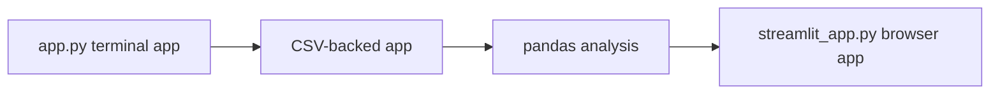

# Track Career Analyzer App

This folder contains Track Career Analyzer, the app built during the bootcamp.

The app starts as a terminal Python program and grows into a pandas-powered Streamlit app.

> [!NOTE]
> Early phases use only `app.py`. The Streamlit file is created later in Phase 08.

## App Growth



## Run The Starter App

```bash
cd app
python3 app.py
```

## Run The Streamlit App

This file exists after Phase 08:

```bash
cd app
streamlit run streamlit_app.py
```

Fallback:

```bash
cd app
python3 -m streamlit run streamlit_app.py
```

## Data

Sample data lives in `data/sample_results.csv`.

The student's working data file is `data/results.csv` once Phase 06 is complete.

## App Link

Deployment status: Not deployed yet. The app can be run locally with Streamlit.

## Final Demo

Use the repository-level final demo checklist:

```text
../docs/final-demo-checklist.md
```
