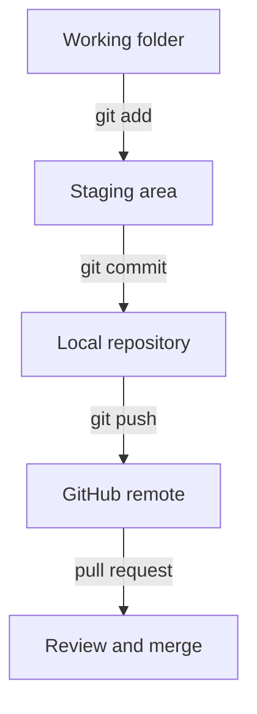

# Git Cheat Sheet

Printable beginner reference.

| Command | What It Does | Example | Beginner Explanation | Caution |
| --- | --- | --- | --- | --- |
| `git --version` | Shows Git version | `git --version` | Confirms Git is installed | None |
| `git status` | Shows repo state | `git status` | Shows changed files and branch | Run often |
| `git init` | Starts a repo | `git init` | Begins tracking a folder with Git | Only once per repo |
| `git clone` | Copies remote repo | `git clone URL` | Downloads a GitHub repo | Use trusted URLs |
| `git branch` | Lists branches | `git branch` | Shows lines of work | Current branch has `*` |
| `git switch -c` | Creates branch | `git switch -c phase-01-first-python` | Starts new work safely | Use clear names |
| `git switch` | Changes branch | `git switch main` | Moves to another branch | Commit or stash first |
| `git add .` | Stages changes | `git add .` | Prepares changed files for commit | Check status first |
| `git commit -m` | Saves snapshot | `git commit -m "Add app"` | Creates a meaningful save point | Message should be clear |
| `git push` | Sends commits to GitHub | `git push -u origin phase-01-first-python` | Uploads branch | Needs remote setup |
| `git pull` | Gets remote changes | `git pull` | Brings GitHub changes down | Can create conflicts |
| `git log --oneline` | Shows history | `git log --oneline` | Compact commit list | Press `q` to quit |
| `git diff` | Shows unstaged changes | `git diff` | Shows exactly what changed | Read before committing |

## Git Flow

```text
Working folder
    ↓ git add
Staging area
    ↓ git commit
Local repository
    ↓ git push
GitHub remote
```



## Beginner Rule

Run `git status` before and after every important Git command.

> [!TIP]
> If Git feels confusing, draw this flow and point to where your file is right now.
