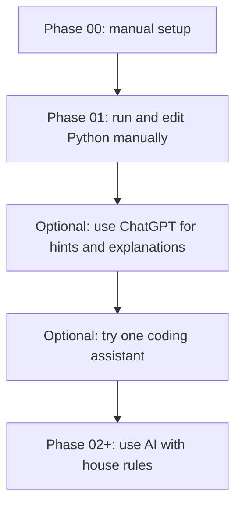

# AI Tooling Landscape 🧭

AI tools are optional in this bootcamp. The goal is to help Riley learn faster, not to replace the learning.

> [!IMPORTANT]
> Finish Phase 00 and the main Phase 01 flow manually before setting up an IDE or terminal coding assistant.

## The Short Version

Start with ChatGPT as a tutor. After Phase 01, optionally try one coding assistant inside the development workflow.

Do not set up five tools at once. Pick one, learn what it is good at, and keep the rules simple.

## Tool Types

| Tool type | Examples | Best for | Watch out for |
| --- | --- | --- | --- |
| Chat tutor | ChatGPT | Explanations, quiz questions, error help, planning | Can write too much if the prompt is too broad |
| IDE assistant | Codex IDE extension, GitHub Copilot | Hints while editing code | Suggestions may look correct before Riley understands them |
| AI-first IDE | Cursor, Windsurf | Heavier AI help inside the editor | Can hide the beginner learning path |
| Terminal agent | Codex CLI, Claude Code, other CLIs | Experienced developer workflows | Too powerful for early phases unless tightly guided |
| Cloud coding agent | Codex web and similar tools | Delegating larger tasks later | Not needed for Phase 00 or Phase 01 |

> [!TIP]
> For Riley, the first useful setup is probably ChatGPT as a tutor plus one optional VS Code assistant after Phase 01.

## Suggested Timing



## Beginner-Safe AI Rules ✅

- Ask for hints before code.
- Ask AI to explain the smallest confusing thing.
- Paste exact error messages.
- Stop and run the code yourself.
- Explain the final code out loud.
- Disclose AI help in every pull request.

## Prompts That Keep Riley In Control

```text
I am in Phase 01. Give me one hint about this error, but do not rewrite my code.
```

```text
Quiz me on what this line does before suggesting a change.
```

```text
Review this small snippet for beginner readability. Do not add new concepts yet.
```

```text
I want to solve this myself. What should I check next?
```

## Setup Notes

Tool setup changes over time. Use each product's official documentation when installing or signing in.

For OpenAI Codex specifically, OpenAI's [Codex with ChatGPT plan help page](https://help.openai.com/en/articles/11369540-codex-in-chatgpt) describes Codex as available through multiple clients, including app, CLI, IDE extension, and web workflows. Availability, limits, and account details can change by plan, so verify the current setup instructions before Riley installs anything.

## Coach Check

After trying an AI tool, ask:

- Did it make the next step clearer?
- Did it write more than Riley could explain?
- Did it interrupt the flow of coding?
- Can Riley make a small live change without it?

If the tool adds confusion, pause it for a phase and continue with the regular curriculum.
