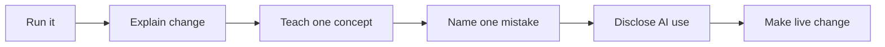

# Demo Guide

Every phase ends with a short show-and-tell demo.

> [!IMPORTANT]
> A demo is not a performance. It is a learning check. Pausing, correcting yourself, and explaining a mistake are all part of the work.

## Demo Script

The student should:

1. Show the code running.
2. Explain what changed.
3. Explain one concept learned.
4. Explain one mistake or bug encountered.
5. Explain how AI was used, if used.
6. Make one small live change without AI.

## Example Live Changes

- Change a printed message.
- Add a new event.
- Rename a variable.
- Add a menu option.
- Add one row to a CSV file.
- Add one statistic to a pandas summary.
- Add one field to the Streamlit dashboard.

## Demo Flow

