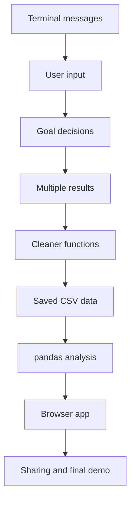
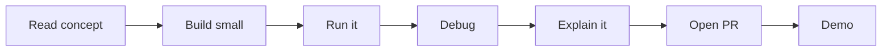

# Project Roadmap

This bootcamp builds Track Career Analyzer in small increments.

> [!TIP]
> Think of the app as the practice track. Each phase adds one skill and one visible improvement.

## Time Expectation

- 10 phases
- 3-5 hours per week
- 25-40 total hours
- Flexible pacing

## Suggested Weekly Rhythm

- 30 minutes reading and concept review
- 45 minutes guided coding
- 45 minutes practice
- 1-2 hours weekend project and demo work

## Project Growth

The app begins as a small terminal program and grows into:

1. A working developer setup with a first reflection PR.
2. A printed welcome message.
3. An athlete profile.
4. Goal comparison logic.
5. Multiple saved results.
6. Cleaner function-based code.
7. CSV-backed persistence.
8. pandas-powered analysis.
9. Streamlit dashboard.
10. Shareable app and final demo project.

## Rhythm Of A Phase

## Optional Bonus Topics

These are not required for the beginner introduction, but they can be added after the core phases if the student is curious.

- **Brewfile setup automation**: introduced lightly in Phase 00 as an optional preview after manual setup.
- **CI/CD with GitHub Actions**: optional bonus after Phase 09 or Phase 10. Use it to explain how teams automatically run checks when code is pushed or a pull request is opened.

CI/CD should not be a required beginner phase. It is useful, but it can distract from the main goals: Python, Git, GitHub, data analysis, Streamlit, and explaining code clearly.

## Final Polish Roadmap

Core curriculum phases 00-10 are drafted. The remaining work is polish, not new required phase design.

| Area | Status | Next pass |
| --- | --- | --- |
| Phase guides | Drafted and decorated | Read end to end for flow, repetition, and learner energy |
| README files | In progress | Make them welcoming without hiding the practical setup details |
| AI guidance | In progress | Keep AI optional, coach-oriented, and easy to disclose |
| Instructor materials | In progress | Make review expectations clear without adding answer keys |
| Diagrams and callouts | In progress | Use only where they reduce cognitive load |
| App scaffold | Intentionally minimal | Leave starter code small until Riley builds through the phases |
| Bonus topics | Drafted separately | Keep Brewfile and CI/CD optional |

Recommended final sequence:

1. Finish the current polish PR review.
2. Merge the current polish PR.
3. Do one clean read-through from Phase 00 to Phase 02 as Riley would experience it.
4. Do one instructor read-through of the reviewer guide and checklists.
5. Mark the repo ready for Riley's first run.
