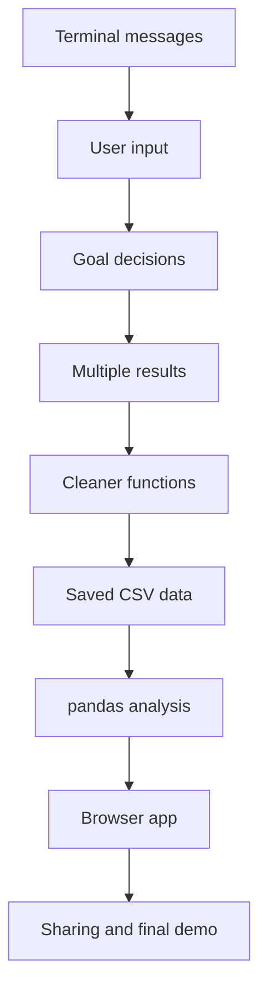
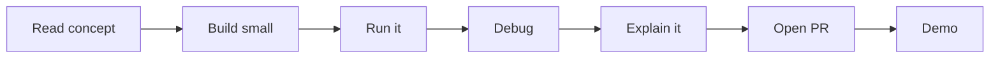

# Project Roadmap

This bootcamp builds Track Career Analyzer in small increments.

> [!TIP]
> Think of the app as the practice track. Each phase adds one skill and one visible improvement.

## Time Expectation

- 10 phases
- 3-5 hours per week
- 25-40 total hours
- Flexible pacing

## Suggested Weekly Rhythm

- 30 minutes reading and concept review
- 45 minutes guided coding
- 45 minutes practice
- 1-2 hours weekend project and demo work

## Project Growth

The app begins as a small terminal program and grows into:

1. A working developer setup with a first reflection PR.
2. A printed welcome message.
3. An athlete profile.
4. Goal comparison logic.
5. Multiple saved results.
6. Cleaner function-based code.
7. CSV-backed persistence.
8. pandas-powered analysis.
9. Streamlit dashboard.
10. Shareable app and final demo project.

## Rhythm Of A Phase

## Optional Bonus Topics

These are not required for the beginner introduction, but they can be added after the core phases if the student is curious.

- **Brewfile setup automation**: introduced lightly in Phase 00 as an optional preview after manual setup.
- **CI/CD with GitHub Actions**: optional bonus after Phase 09 or Phase 10. Use it to explain how teams automatically run checks when code is pushed or a pull request is opened.

CI/CD should not be a required beginner phase. It is useful, but it can distract from the main goals: Python, Git, GitHub, data analysis, Streamlit, and explaining code clearly.

## Launch Readiness

Core curriculum phases 00-10 are drafted and ready for Riley's first guided run.

| Area | Reality after walkthrough | Next action |
| --- | --- | --- |
| Phase guides | Complete enough for a beginner-guided run | Use them with Riley and adjust only where she actually gets stuck |
| README files | Clear on audience, Python choice, AI choice, and local run path | Keep deployment status current if the app is later published |
| AI guidance | Optional and coach-oriented | Reinforce PR disclosure and live explain-back during reviews |
| Instructor materials | Public-safe and review-focused | Keep answer keys out of this repository |
| App scaffold | Intentionally minimal on `main` | Let Riley build the app through the phase PRs |
| Dependencies | `requirements.txt` is present; `.venv/` is ignored | Use a local virtual environment before installing pandas or Streamlit |
| Bonus topics | Brewfile and CI/CD are optional extras | Save them for after the first bootcamp pass unless Riley is curious |

## Walkthrough Findings

The final pre-launch walkthrough used a fresh clone and followed the curriculum as Riley would experience it.

- Phase 00-01: starter repo and first Python run are short and confidence-building.
- Phase 02-05: terminal app flow builds cleanly from variables to functions.
- Phase 06: CSV persistence works when the app is run from inside `app`.
- Phase 07-08: pandas and Streamlit require dependency setup; use `.venv` to avoid Homebrew Python package-install errors.
- Phase 09: deployment is correctly optional; local sharing is an acceptable outcome.
- Phase 10: final checklist and retrospective already exist as starter files, so the student should update them.

## Ready Criteria

The repo is ready for Riley's first run when:

- Local `main` matches `origin/main`.
- Old local phase branches are deleted.
- Riley can clone the repo and run `python3 app.py` from `app`.
- The facilitator knows Phase 07 starts the `.venv` dependency setup.
- Reviews focus on explanation, not speed.
