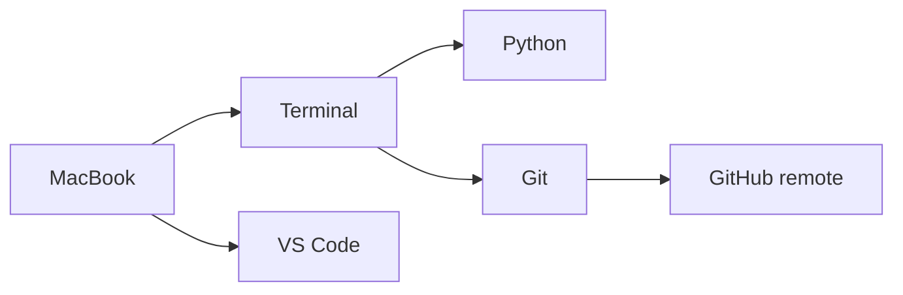

# Phase 00: Developer Workstation

## Goal

Set up and understand the basic tools used by a beginner software engineer.

By the end of this phase, you should be able to open Terminal, find this project folder, open it in VS Code, verify that the main tools are installed, and explain the difference between your local computer, Git, and GitHub.

> [!TIP]
> This phase is the warmup lap. Move slowly, run the commands yourself, and say out loud what each tool does.

## At A Glance

| You will | Why it matters |
| --- | --- |
| Open Terminal | Developers need a command center |
| Set up GitHub SSH access | GitHub needs to know this Mac is allowed to clone and push |
| Open the repo in VS Code | Code lives in project folders |
| Verify tools | You need Python, Git, Homebrew, and VS Code ready |
| Create a branch and PR | Every phase practices real GitHub workflow |
| Optional: read the Brewfile | See how setup can be automated later |



## Why This Phase Matters

Before writing much Python, you need to know where your files live and how developers run tools. This phase is about comfort, not speed.

You are learning the developer workspace:

- **Terminal**: where you type commands.
- **VS Code**: where you read and edit code.
- **Python**: the programming language this bootcamp uses.
- **Git**: the tool that saves project history on your computer.
- **GitHub**: the website that stores a copy of the project online.
- **Homebrew**: a Mac tool used to install developer software.

## Time Estimate

Plan for 60-90 minutes.

Take more time if Terminal is new. That is normal.

## Before You Start

You need:

- A MacBook
- Internet access
- A GitHub account
- Write access to this GitHub repository
- VS Code installed
- This repository available on GitHub

You do not need to understand Python yet.

## Step 1: Open Terminal

Open the Terminal app on your Mac.

> [!NOTE]
> Terminal is not scary; it is just another way to talk to your computer. The trick is knowing where you are before you type commands.

Try this command:

```bash
pwd
```

`pwd` means "print working directory." It tells you which folder Terminal is currently looking at.

Expected result: Terminal prints a path, such as:

```text
/Users/riley
```

Your exact path may be different.

## Step 2: Learn Three Navigation Commands

Run:

```bash
ls
```

`ls` lists the files and folders in your current folder.

Run:

```bash
cd ..
```

`cd ..` moves up one folder.

Run:

```bash
pwd
```

Use `pwd` again to see where you are now.

Beginner rule: when you feel lost in Terminal, run `pwd`.

## Step 3: Set Up GitHub SSH Access

GitHub needs a way to recognize your Mac before you clone, push, and open pull requests. This bootcamp uses SSH keys for that.

First, check whether your Mac already has an SSH key:

```bash
ls ~/.ssh
```

If you see a file named `id_ed25519.pub`, you probably already have a key. Skip the `ssh-keygen` command and continue with the SSH agent step below.

If you do not see `id_ed25519.pub`, create a new key. Use the email address connected to your GitHub account:

```bash
ssh-keygen -t ed25519 -C "your-email@example.com"
```

When Terminal asks where to save the key, press `Enter` to accept the default location.

When Terminal asks for a passphrase, you can press `Enter` twice to leave it blank for this beginner setup.

Add the key to your Mac's SSH agent:

```bash
eval "$(ssh-agent -s)"
ssh-add --apple-use-keychain ~/.ssh/id_ed25519
```

Copy your public key:

```bash
pbcopy < ~/.ssh/id_ed25519.pub
```

Now add the key to GitHub:

1. Open GitHub in your browser.
2. Click your profile picture.
3. Open `Settings`.
4. Open `SSH and GPG keys`.
5. Click `New SSH key`.
6. Use a title like `Riley MacBook`.
7. Paste the copied key.
8. Click `Add SSH key`.

Test the connection:

```bash
ssh -T git@github.com
```

Expected idea: GitHub should recognize your username. It may say GitHub does not provide shell access. That is okay.

If GitHub says `Permission denied (publickey)`, the key is not connected correctly yet. Stop and ask for help before cloning.

## Step 4: Get The Project Onto Your Mac

If the repository is not already on your Mac, clone it from GitHub.

First, choose a place for coding projects. This example uses a `projects` folder:

```bash
cd ~
mkdir -p projects
cd projects
```

Clone the repository:

```bash
git clone git@github.com:ericchapman80/programming-intro-python-bootcamp.git
```

Move into the project:

```bash
cd programming-intro-python-bootcamp
```

Check where you are:

```bash
pwd
```

Expected result: the path should end with:

```text
programming-intro-python-bootcamp
```

If the repo is already on your Mac, navigate to that folder instead of cloning again.

## Step 5: Open The Project In VS Code

From inside the project folder, run:

```bash
code .
```

This opens the current folder in VS Code.

If `code .` does not work, open VS Code manually. Then use:

```text
File -> Open Folder
```

Choose the `programming-intro-python-bootcamp` folder.

## Step 6: Verify Developer Tools

Run each command separately.

```bash
brew --version
```

Confirms Homebrew is installed.

```bash
python3 --version
```

Confirms Python 3 is installed.

```bash
git --version
```

Confirms Git is installed.

```bash
code --version
```

Confirms the VS Code command line tool is installed.

Do not worry if your version numbers differ from someone else's.

## Step 7: Inspect The Repository

From the project folder, run:

```bash
ls
```

You should see files and folders such as:

```text
README.md
AI_GUIDELINES.md
CONCEPTS.md
app
phases
docs
```

Now ask Git what it sees:

```bash
git status
```

Expected idea:

- You are on a branch.
- Git tells you whether files have changed.
- A clean repo means there is nothing to commit yet.

The exact wording may vary.

## Step 8: Create Your Phase Branch

Branches let you work without changing the main version immediately.

> [!IMPORTANT]
> A branch is your practice lane. `main` stays clean while you work on one phase.

Create a branch for this phase:

```bash
git switch -c phase-00-setup
```

Check your branch:

```bash
git status
```

Expected idea: Git should say you are on branch `phase-00-setup`.

If the branch already exists, use:

```bash
git switch phase-00-setup
```

## Step 9: Make A Small Learning Change

Create a reflection file for this phase:

```bash
touch reflections/phase-00-reflection.md
```

Open `reflections/phase-reflection-template.md` in VS Code.

Copy the template into `reflections/phase-00-reflection.md`.

Fill in short answers for:

- What I learned
- Commands I used
- Bugs or mistakes
- AI usage
- Demo notes

This reflection is the deliverable for Phase 00.

## Step 10: Save Your Work With Git

Check changed files:

```bash
git status
```

Stage your reflection:

```bash
git add reflections/phase-00-reflection.md
```

Commit your work:

```bash
git commit -m "Complete phase 00 reflection"
```

Push your branch to GitHub:

```bash
git push -u origin phase-00-setup
```

## Step 11: Open A Pull Request

Go to this repository on GitHub:

```text
https://github.com/ericchapman80/programming-intro-python-bootcamp
```

Open a pull request from:

```text
phase-00-setup -> main
```

Fill out the pull request template.

Be specific in the AI usage section. If you did not use AI, say that.

## Optional: Automating Mac Setup With A Brewfile

Do this section only after you understand the manual setup steps above.

> [!NOTE]
> This is a preview of how teams help future developers get set up faster. It is optional for Riley's first pass.

Manual setup matters because it teaches what each tool does. A `Brewfile` is different: it is a way to document developer tools so another person can install the same tools faster.

This repository includes:

```text
Brewfile
```

Open it and read it.

It lists Mac developer tools for this bootcamp:

```ruby
brew "git"
brew "python"

cask "visual-studio-code"
```

If someone has Homebrew installed, they can install the tools from the Brewfile with:

```bash
brew bundle --file=Brewfile
```

You can also ask Homebrew what tools are currently installed and write them to a Brewfile:

```bash
brew bundle dump --file=Brewfile
```

Do not run `brew bundle dump` in this repository during Phase 00 unless an instructor asks you to. It may add extra tools from your personal MacBook that do not belong in this beginner project.

Important idea:

- Manual setup teaches what tools are.
- A Brewfile documents expected tools.
- `brew bundle` helps another developer recreate a similar setup.

This is a small preview of reproducible developer environments. It is not required to move on.

## Common Stuck Points

### `code .` does not work

Open VS Code manually and use `File -> Open Folder`.

Later, install the VS Code shell command from inside VS Code:

```text
Command Palette -> Shell Command: Install 'code' command in PATH
```

### `git clone` says the folder already exists

You probably already cloned the repo. Use `cd programming-intro-python-bootcamp` instead.

### `git clone` or `git push` says `Permission denied (publickey)`

GitHub does not recognize this Mac's SSH key yet. Go back to Step 3 and make sure the public key was added to GitHub.

### `git switch -c phase-00-setup` says the branch already exists

Use:

```bash
git switch phase-00-setup
```

### Terminal says `command not found`

Check spelling first. If spelling is correct, the tool may not be installed or configured.

Ask for help with the exact command and exact error message.

## AI Guidelines For This Phase

Good AI prompts:

```text
I am in Phase 00. Explain what this Terminal command does, but do not give me extra commands yet: pwd
```

```text
I ran git status and got this output. Explain it like I am new to Git.
```

```text
Ask me three questions to check whether I understand local files, Git, and GitHub.
```

Avoid prompts like:

```text
Do Phase 00 for me.
```

## Demo

Show:

- Terminal open in the project folder.
- `pwd`
- `ls`
- `python3 --version`
- `git --version`
- `git status`
- The project open in VS Code.
- Your `reflections/phase-00-reflection.md` file.

Explain:

- What Terminal is.
- What VS Code is.
- What Python is.
- What Git is.
- What GitHub is.
- What local vs remote means.
- Optional: what a Brewfile is.

Live change:

- Add one sentence to your reflection without AI.
- Save the file.
- Run `git status` and explain what changed.

## Good Enough To Move On

You are ready for Phase 01 when:

- You can open Terminal.
- You can navigate to the project folder.
- You can open the project in VS Code.
- You can run the tool version commands.
- You can explain local vs remote in plain language.
- You created, committed, pushed, and opened a PR for your Phase 00 reflection.

Optional:

- You can explain why a Brewfile helps another developer set up a similar Mac.
