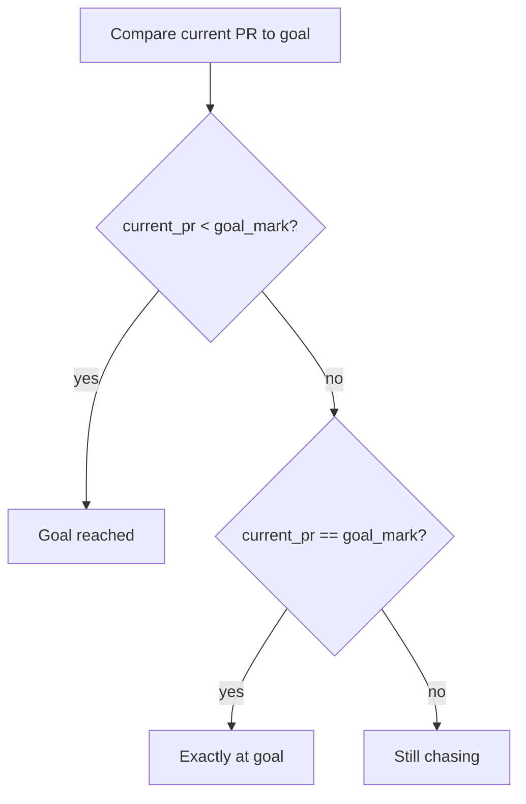

# Phase 03: Conditionals and Goals

## Goal

Use conditionals to compare an athlete's current mark against a goal.

By the end of this phase, you should be able to write `if`, `elif`, and `else` statements, explain comparison operators, and show different messages depending on whether an athlete has reached a goal.

> [!TIP]
> This phase is about decisions. The app looks at data and chooses what message to show.

## At A Glance

| You will | What it teaches |
| --- | --- |
| Add a goal mark | Programs can compare values |
| Use `if` | Run code when a condition is true |
| Use `elif` | Check another possible condition |
| Use `else` | Handle everything left over |
| Test three cases | Good developers test each path |

## Why This Phase Matters

Programs become more useful when they can make decisions.

In Phase 02, the app collected athlete profile information. In Phase 03, the app starts responding to that information by deciding whether the athlete is still chasing a goal, exactly at the goal, or past the goal.

This is the beginning of real app logic.

## Time Estimate

Plan for 90-120 minutes.

Conditionals are important. It is worth testing each path slowly.

## Before You Start

You should be able to:

- Run `python3 app.py`.
- Explain variables.
- Use `input()`.
- Explain why `input()` returns text.
- Use `float()` for a decimal number.
- Commit, push, and open a pull request.

## New Concepts

### Conditional

A conditional lets code make a decision.

Example:

```python
if current_pr <= goal_mark:
    print("Goal reached")
```

The code inside the `if` only runs when the condition is true.

### Boolean

A Boolean is either `True` or `False`.

Example:

```python
current_pr <= goal_mark
```

Python checks that comparison and decides whether it is `True` or `False`.

### Comparison Operators

Comparison operators compare two values.

| Operator | Meaning |
| --- | --- |
| `>` | greater than |
| `<` | less than |
| `>=` | greater than or equal to |
| `<=` | less than or equal to |
| `==` | equal to |
| `!=` | not equal to |

Important: `=` assigns a value. `==` compares two values.

Example:

```python
goal_mark = 58.0
current_pr == goal_mark
```

### `if`, `elif`, and `else`

Use `if` for the first condition.

Use `elif` for another condition.

Use `else` for everything that did not match above.

Example:

```python
if current_pr < goal_mark:
    print("Goal reached")
elif current_pr == goal_mark:
    print("Exactly at the goal")
else:
    print("Still chasing")
```



### Indentation

Python uses indentation to know which lines belong inside a conditional.

This works:

```python
if current_pr < goal_mark:
    print("Goal reached")
```

This does not work:

```python
if current_pr < goal_mark:
print("Goal reached")
```

The printed line must be indented.

## A Track Mark Note

For this phase, use decimal numbers and a simple rule:

> [!NOTE]
> Track marks are more complex in real life. This phase uses decimal running times so the coding concept stays clear.

For timed running events, lower is better.

Example:

```text
Current PR: 57.85
Goal mark: 57.50
```

Because `57.85` is slower than `57.50`, the athlete is still chasing the goal.

Later phases can handle field events where higher is better.

## Step 1: Start From `main`

Make sure your local `main` branch is up to date:

```bash
git switch main
git pull
```

Create your Phase 03 branch:

```bash
git switch -c phase-03-goal-conditionals
```

If the branch already exists, use:

```bash
git switch phase-03-goal-conditionals
```

Check:

```bash
git status
```

Expected idea: Git should say you are on branch `phase-03-goal-conditionals`.

## Step 2: Run The Current App

Run the app before changing it:

```bash
cd app
python3 app.py
cd ..
```

The app should collect profile information from Phase 02.

## Step 3: Add A Goal Input

Open:

```text
app/app.py
```

Near the other profile inputs, ask for a goal mark:

```python
goal_mark = float(input("Goal mark: "))
```

Use decimal values while testing.

Example:

```text
Current PR: 57.85
Goal mark: 57.50
```

Run the app and make sure it asks for the new goal.

## Step 4: Add A First `if` Statement

Add this after the profile output:

```python
if current_pr < goal_mark:
    print("Goal reached!")
```

Run the app with:

```text
Current PR: 57.30
Goal mark: 57.50
```

Expected idea: because `57.30` is lower/faster than `57.50`, the app should print:

```text
Goal reached!
```

## Step 5: Add `elif` For An Exact Match

Update the conditional:

```python
if current_pr < goal_mark:
    print("Goal reached!")
elif current_pr == goal_mark:
    print("Exactly at the goal!")
```

Run the app with:

```text
Current PR: 57.50
Goal mark: 57.50
```

Expected idea: the app should print:

```text
Exactly at the goal!
```

## Step 6: Add `else` For Still Chasing

Update the conditional:

```python
if current_pr < goal_mark:
    print("Goal reached!")
elif current_pr == goal_mark:
    print("Exactly at the goal!")
else:
    print("Still chasing the goal.")
```

Run the app with:

```text
Current PR: 57.85
Goal mark: 57.50
```

Expected idea: the app should print:

```text
Still chasing the goal.
```

## Step 7: Print The Difference

Add a variable that calculates the difference:

```python
difference = current_pr - goal_mark
```

For a running event:

- A positive difference means the athlete is still slower than the goal.
- A negative difference means the athlete is faster than the goal.
- Zero means the athlete exactly matched the goal.

Add a useful message inside the `else` block:

```python
else:
    print("Still chasing the goal.")
    print(f"Difference: {difference} seconds")
```

Keep the math simple for now.

## Step 8: Test All Three Paths

Run the app at least three times.

### Faster Than Goal

```text
Current PR: 57.30
Goal mark: 57.50
```

Expected message:

```text
Goal reached!
```

### Exactly At Goal

```text
Current PR: 57.50
Goal mark: 57.50
```

Expected message:

```text
Exactly at the goal!
```

### Still Chasing

```text
Current PR: 57.85
Goal mark: 57.50
```

Expected message:

```text
Still chasing the goal.
```

## Step 9: Practice An Indentation Error

This step is optional but useful.

Temporarily remove the indentation under an `if` statement:

```python
if current_pr < goal_mark:
print("Goal reached!")
```

Run the app.

Python should show an indentation error.

Read the error, then fix the indentation immediately.

Run the app again to confirm it works.

Do not commit broken code.

## Step 10: Create Your Phase Reflection

Create:

```text
reflections/phase-03-reflection.md
```

Use the template from:

```text
reflections/phase-reflection-template.md
```

Fill in short answers for:

- What a conditional is
- What `if`, `elif`, and `else` do
- What comparison operators you used
- Why indentation matters
- How you tested all three paths
- Whether you used AI

## Step 11: Check Your Work With Git

From the main repository folder, run:

```bash
git status
```

You should normally see:

```text
app/app.py
reflections/phase-03-reflection.md
```

Review the code change:

```bash
git diff app/app.py
```

## Step 12: Commit And Push

Stage only the Phase 03 files:

```bash
git add app/app.py reflections/phase-03-reflection.md
```

Commit:

```bash
git commit -m "Complete phase 03 goal conditionals"
```

Push:

```bash
git push -u origin phase-03-goal-conditionals
```

## Step 13: Open A Pull Request

Open a pull request from:

```text
phase-03-goal-conditionals -> main
```

Fill out the pull request template.

In the AI disclosure, include any prompt you used to understand conditionals, comparisons, booleans, or error messages.

## Common Stuck Points

### `IndentationError`

Python expected an indented line after `if`, `elif`, or `else`.

This is correct:

```python
if current_pr < goal_mark:
    print("Goal reached!")
```

### The wrong message prints

Check the comparison operator.

For running times in this phase, lower is better:

```python
current_pr < goal_mark
```

means the current PR is faster than the goal.

### Confusing `=` and `==`

Use `=` to store a value:

```python
goal_mark = 57.50
```

Use `==` to compare values:

```python
current_pr == goal_mark
```

### Decimal numbers feel weird

Track marks can be more complicated than plain decimals. For Phase 03, decimal numbers are enough because the goal is learning conditionals.

### `ValueError` appears again

The app still uses `float()`. Type only a number, such as:

```text
57.85
```

Do not type:

```text
57.85 seconds
```

## AI Guidelines For This Phase

Good AI prompts:

```text
I am in Phase 03. Explain this condition like I am new to Python: current_pr < goal_mark
```

```text
I got an IndentationError. Explain the clue, but do not rewrite my whole program.
```

```text
Ask me questions to check whether I understand if, elif, and else.
```

Avoid prompts like:

```text
Write the complete Phase 03 goal comparison program for me.
```

## Demo

Show:

- `app/app.py` in VS Code.
- The app running in Terminal.
- A test where the athlete is faster than the goal.
- A test where the athlete exactly matches the goal.
- A test where the athlete is still chasing.
- Your Phase 03 reflection.

Explain:

- What a conditional is.
- What `if`, `elif`, and `else` do.
- What comparison operators do.
- Why lower is better for timed events in this phase.
- Why indentation matters.
- One error or mistake you saw.
- How AI helped, if you used it.

Live change:

- Change one printed goal message without AI.
- Save the file.
- Run the app again.
- Explain why the output changed.

## Good Enough To Move On

You are ready for Phase 04 when:

- You can run the goal comparison program.
- You can explain the full `if` / `elif` / `else` block.
- You can explain the comparison operators you used.
- You can test faster, equal, and still-chasing cases.
- You can make one small goal-message change without AI.
- You committed and pushed your Phase 03 work.
- You opened a pull request and completed the AI disclosure.
