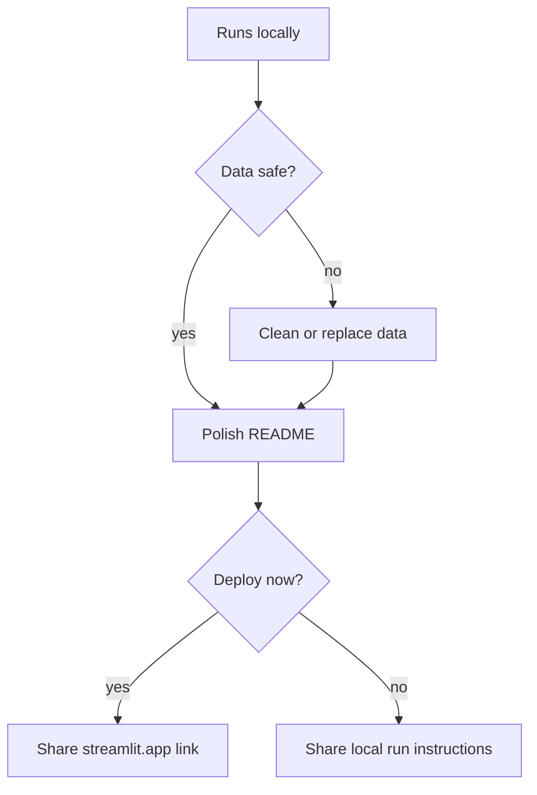

# Phase 09: Deployment and Sharing

## Goal

Prepare Track Career Analyzer to be shared, and deploy it if the app and data are ready.

By the end of this phase, you should be able to explain what deployment means, check a public repository for privacy and readiness, polish the README, deploy a Streamlit app from GitHub, and share either a deployed app link or clear local run instructions.

> [!TIP]
> Phase 09 is not just "put it online." It is "decide responsibly whether this is ready to share."

## At A Glance

| You will | What it teaches |
| --- | --- |
| Run the app locally | Deployment starts with a working app |
| Check data/privacy | Public sharing has responsibility |
| Polish READMEs | Other people need instructions |
| Prepare Streamlit Cloud | GitHub can feed a deployed app |
| Share or defer | A clear decision beats a rushed link |



## Why This Phase Matters

Building an app is only part of software engineering.

A developer also needs to decide whether the app is safe to share, whether another person can run it, and what the user should know before opening it.

Phase 09 is about responsible sharing.

## Time Estimate

Plan for 2-3 hours.

Deployment can involve account setup and waiting for a cloud service. If deployment is not ready, complete the public-readiness checklist and share the local app instead.

## Before You Start

You should be able to:

- Run the Streamlit app locally.
- Explain localhost.
- Explain where CSV data lives.
- Explain what information is safe or unsafe to publish.
- Use GitHub pull requests.
- Update README files.

## New Concepts

### Deployment

Deployment means putting an app somewhere other people can access it.

Local app:

```text
Runs on your MacBook
```

Deployed app:

```text
Runs on a hosted service and has a shareable URL
```

### Public Repo Readiness

Public repo readiness means the repository is safe and useful for strangers to view.

Check for:

- No private secrets
- No private personal data
- Clear README
- Working run instructions
- Dependencies listed
- Public-safe sample data

### Secret

A secret is sensitive information that should not be committed to GitHub.

> [!WARNING]
> Secrets do not belong in a public repo. If a file contains passwords, tokens, keys, or private URLs, stop before committing.

Examples:

- Passwords
- API keys
- Private tokens
- Database URLs

This bootcamp app should not need secrets yet.

### Entry Point

The entry point is the file the deployed service runs.

For this Streamlit app:

```text
app/streamlit_app.py
```

### Dependency

A dependency is a library the app needs.

This repository lists dependencies in:

```text
requirements.txt
```

For this project, important dependencies include:

```text
pandas
streamlit
```

## Recommended Beginner Deployment Path

Use Streamlit Community Cloud as the recommended beginner path.

Official docs:

```text
https://docs.streamlit.io/deploy/streamlit-community-cloud/deploy-your-app/deploy
```

The current Streamlit Community Cloud flow is GitHub-based:

1. Go to `share.streamlit.io`.
2. Create or sign in to a Streamlit Community Cloud account.
3. Click `Create app`.
4. Choose that you already have an app.
5. Select the GitHub repository, branch, and entry point file.
6. Deploy and wait for the app to launch.
7. Share the generated `streamlit.app` URL if the app is public-ready.

## Step 1: Start From `main`

Make sure your local `main` branch is up to date:

```bash
git switch main
git pull
```

Create your Phase 09 branch:

```bash
git switch -c phase-09-deployment-sharing
```

If the branch already exists, use:

```bash
git switch phase-09-deployment-sharing
```

Check:

```bash
git status
```

Expected idea: Git should say you are on branch `phase-09-deployment-sharing`.

## Step 2: Run The App Locally

From the repository root:

```bash
cd app
streamlit run streamlit_app.py
```

If the `streamlit` command does not work, try:

```bash
python3 -m streamlit run streamlit_app.py
```

Open the local URL in a browser.

Confirm:

- The app starts.
- The table loads.
- The event filter works.
- At least one metric displays.
- The chart displays.

Stop the app with `Control-C`.

## Step 3: Confirm Dependencies

Open:

```text
requirements.txt
```

It should include:

```text
pandas
streamlit
```

Run:

```bash
python3 -m venv .venv
source .venv/bin/activate
python -m pip install -r requirements.txt
```

This confirms another environment can install the same libraries without changing the system Python.

## Step 4: Check Public Data

Open:

```text
app/data/results.csv
app/data/sample_results.csv
```

Check:

- Is every row safe to publish?
- Are names, notes, and meet details intentionally public?
- Does the data contain private contact information?
- Does the data contain anything the student would not want online?

If the data is too personal, replace it with generic sample rows.

Public-safe sample row:

```csv
2026-04-12,400m,58.20,Spring Invite,Sample result
```

## Step 5: Check For Secrets

Run:

```bash
git status
```

Look for files that should not be committed.

Also check for local environment files:

```bash
ls -a
```

Do not commit:

```text
.env
.streamlit/secrets.toml
```

The `.gitignore` should already ignore these files.

## Step 6: Polish The App README

Open:

```text
app/README.md
```

Add or confirm:

- What the app does
- How to run the terminal app
- How to run the Streamlit app
- Where the data lives
- What phase the app is currently in

Example run instructions:

```bash
cd app
streamlit run streamlit_app.py
```

Also include the fallback:

```bash
cd app
python3 -m streamlit run streamlit_app.py
```

## Step 7: Polish The Root README

Open:

```text
README.md
```

Confirm it clearly explains:

- This is a curriculum repository.
- The app is under `app/`.
- The current project app is Track Career Analyzer.
- Phase guides live under `phases/`.
- The repo is licensed for reuse.

If the app is deployed, add the app link.

If the app is not deployed yet, add:

```text
Deployment status: Not deployed yet.
```

## Step 8: Optional Deployment

Only deploy if:

> [!IMPORTANT]
> "Not deployed yet" is a valid Phase 09 result if privacy or readiness checks are not complete.

- The app runs locally.
- The repo is public-ready.
- The CSV data is safe to share.
- The student understands what will become public.

Go to:

```text
https://share.streamlit.io
```

Create the app with:

```text
Repository: ericchapman80/programming-intro-python-bootcamp
Branch: main
Main file path: app/streamlit_app.py
```

If asked for Python version, use the default unless the app needs a specific version.

This app should not need secrets.

## Step 9: Save The Deployment Link

If deployment succeeds, add the app link to:

```text
README.md
app/README.md
```

Use a simple section:

```markdown
## App Link

Deployed app: https://example.streamlit.app
```

If deployment does not happen, write:

```markdown
## App Link

Deployment status: Not deployed yet. The app can be run locally with Streamlit.
```

## Step 10: Update The Sharing Note

Open:

```text
docs/sharing-note-template.md
```

Use this short template when sharing the app:

```markdown
# Track Career Analyzer

I built this app as part of a beginner Python bootcamp.

It analyzes track results from a CSV file using pandas and Streamlit.

What it shows:

- Saved results
- Event filtering
- Best mark
- Average mark
- Goal progress
- Simple chart

This is a learning project, not a finished commercial app.
```

## Step 11: Create Your Phase Reflection

Create:

```text
reflections/phase-09-reflection.md
```

Use the template from:

```text
reflections/phase-reflection-template.md
```

Fill in short answers for:

- What deployment means
- What public repo readiness means
- What data was checked
- Whether the app was deployed
- What link can be shared, if any
- One issue or decision from this phase
- Whether you used AI

## Step 12: Check Your Work With Git

From the main repository folder, run:

```bash
git status
```

You may see changes to:

```text
README.md
app/README.md
docs/sharing-note-template.md
reflections/phase-09-reflection.md
```

If deployment required app or data cleanup, you may also see:

```text
app/streamlit_app.py
app/data/results.csv
```

Review README changes:

```bash
git diff README.md app/README.md
```

## Step 13: Commit And Push

Stage only the Phase 09 files:

```bash
git add README.md app/README.md docs/sharing-note-template.md reflections/phase-09-reflection.md
```

If you intentionally changed app/data files, add those too:

```bash
git add app/streamlit_app.py app/data/results.csv
```

Commit:

```bash
git commit -m "Complete phase 09 deployment sharing"
```

Push:

```bash
git push -u origin phase-09-deployment-sharing
```

## Step 14: Open A Pull Request

Open a pull request from:

```text
phase-09-deployment-sharing -> main
```

Fill out the pull request template.

In the AI disclosure, include any prompt you used to understand deployment, public repo readiness, README writing, Streamlit Community Cloud, or privacy checks.

## Common Stuck Points

### The app runs locally but not on Streamlit Community Cloud

Check:

- Is `requirements.txt` committed?
- Is the entry point `app/streamlit_app.py`?
- Does the app use the correct data path?
- Does `app/data/results.csv` exist in GitHub?

### Streamlit cannot find the data file

Check the app path and data path.

The app should use:

```python
DATA_FILE = "data/results.csv"
```

when Streamlit runs from the `app` folder.

### The app should not be public yet

That is acceptable.

The Phase 09 deliverable can be a public-readiness review plus local sharing instructions.

### The deployed URL changes or looks long

That is normal. Streamlit apps are hosted on `streamlit.app`, and Community Cloud can generate a unique URL.

### You find private data

Stop and replace it with generic sample data before sharing.

## AI Guidelines For This Phase

Good AI prompts:

```text
I am in Phase 09. Review this README for whether another beginner could run the Streamlit app.
```

```text
Ask me questions to check whether my repo is safe to make public.
```

```text
I got a Streamlit deployment error. Explain the clue, but do not rewrite my whole app.
```

Avoid prompts like:

```text
Deploy this app for me and ignore privacy checks.
```

## Demo

Show:

- The app running locally or deployed.
- The repository README.
- The app README.
- The CSV data that is safe to share.
- The sharing note template.
- Your Phase 09 reflection.

Explain:

- What deployment means.
- What localhost means compared with a deployed URL.
- What public repo readiness means.
- What data was checked.
- Whether the app was deployed and why.
- How someone else can run or view the app.
- How AI helped, if you used it.

Live change:

- Improve one README sentence without AI.
- Save the file.
- Explain why clearer instructions matter.

## Good Enough To Move On

You are ready for Phase 10 when:

- The app can be run locally.
- The repo has clear run instructions.
- Public data has been reviewed.
- Secrets are not committed.
- Deployment is complete or intentionally deferred.
- A sharing note exists.
- You committed and pushed your Phase 09 work.
- You opened a pull request and completed the AI disclosure.
